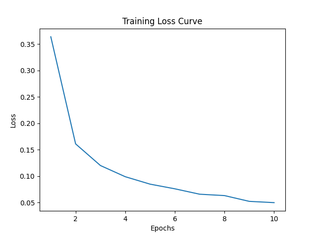

# CSE3022M：Introduction to Big Data Analytics and Application
Personal assignment repository for course "Introduction to Big Data Analytics and Application", Zhejiang University

## Assignment 1: Adapted K-Means Algorithm
Use Canopy+K-Means algorithm
[Turn to assignment 1](https://github.com/ShinyueYao/ZJU_CSE3022M/tree/master/assignment_1)

### Result:

## Assignment 2: Implement Back Propagation
Implement BP and visualize the loss during training
[Turn to assginment 2](https://github.com/ShinyueYao/ZJU_CSE3022M/tree/master/assignment_2)

### Result:

