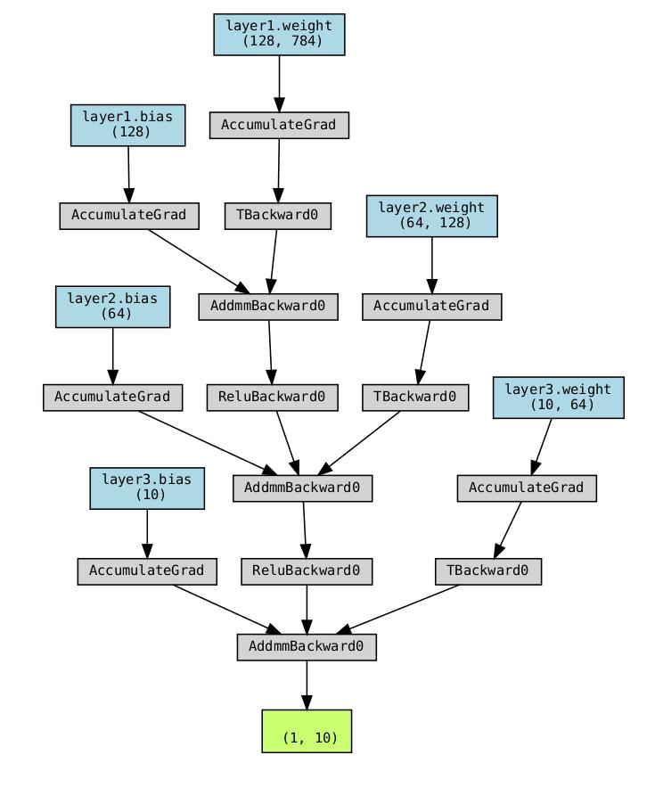

# CSE3022M：Introduction to Big Data Analytics and Application
Personal assignment repository for course "Introduction to Big Data Analytics and Application", Zhejiang University

| **Description**                                                      | **Assignment 1: Adapted K-Means Algorithm**                       | **Assignment 2: Implement Back Propagation**                        |
|--------------------------------------------------------------------|------------------------------------------------------------------|--------------------------------------------------------------------|
| Use Canopy+K-Means algorithm for clustering. [Link to Assignment 1](https://github.com/ShinyueYao/ZJU_CSE3022M/tree/master/assignment_1) |     |     |
