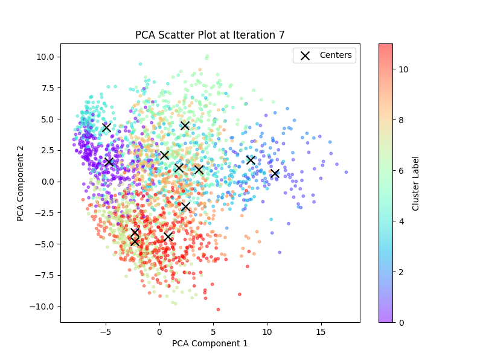

# CSE3022M：Introduction to Big Data Analytics and Application
Personal assignment repository for course "Introduction to Big Data Analytics and Application", Zhejiang University

## Assignment 1: Adapted K-Means Algorithm
[Turn to assignment 1](./assignment_1/README.md)

### Result:

