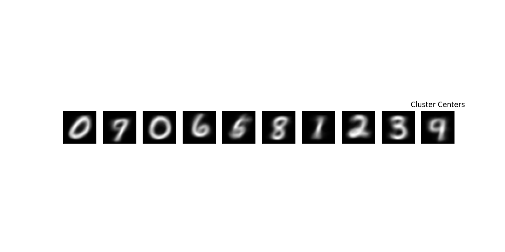

# ZJU_CSE3022M
Personal assignment for course "Introduction to Big Data Analytics and Application"

## Assignment 1: Adapted K-Means Algorithm
[Turn to assignment 1](./assignment_1/README.md)

### Result:

