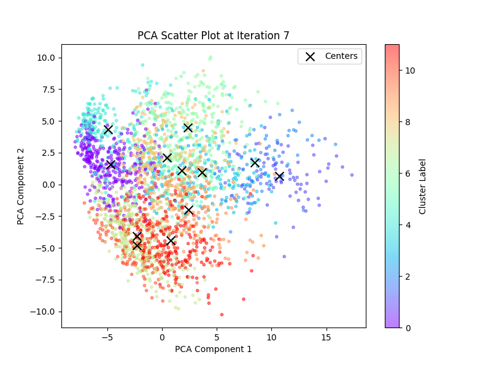
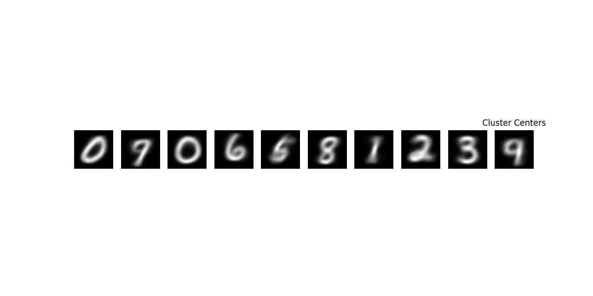
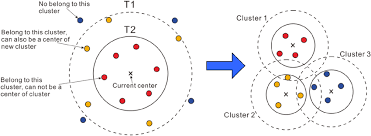

# Assignment 1: Implement an adapted K-Means Algorithm for MNIST and visualize the result

## 1. Quick Start
### 1.1 Prerequisite
Make sure you have basic python environment on your computer

Install Pytorch on [official website](https://pytorch.org/)

### 1.2 Prepare the environment
```shell
cd assignment_1

pip install -r requirements.txt
```

### 1.3 Run the code
```
python main.py
```

### 1.4 Expected Result
During the iteration of K-Means, a PCA scatter image will be shown such as:


And each image will be saved at ``./output/iteration``

Finally, the image for each cluster center will be shown:



## 2. Method

### Problem setting
As the requirement of this assignment, we **do not know** a  proper $k$ for the K-Means algorithm. Below is how I analyzed this problem.

1. Analyze the cons for K-Means algorithm :
- $k$ sensitive 
- High complexity during each iteration

2. Research some papers related to the k-means algorithm

3. Find an appropriate way : Canopy Algorithm

---
### Why canopy

1. Canopy algorithm is not relying on transcendental $k$ comparing to **Elbow Method**
2. More efficient comparing to **Gap Statistic, Silouette Coefficient**. [[1]](#3-reference)
---
### Canopy Algorithm

The step of this canopy algorithm is:
1. roughly define 2 thresholds, $t_1 > t_2$ and a data list $L=\{ x_1, x_2 \dots x_m \}$
2. Select a point $P$ in $L$, calculate the **Distances** between $P$ and every **cluster center** , and we choose the least Distance $D(P,a_j)$ (if there is no **center**, we assign $P$ as a new cluster)
3. If $D$ is less than $t_1$, then the point $P$ is belong to this cluster
4. If $D$ is less than $t_2$, then the point $P$ is belong to this cluster, and is very close to the cluster center, so we delete the point $P$ from $L$ because it has found its cluster.
5. If $D$ is greater than $t_1$, then the point $P$ will form a new cluster
6. Repeat untill $L$ is empty or becomes unvariable, end the loop.



---
Then, we can use canopy to roughly select $k$ cluster centers as the initial centers in K-Means.

## 3. Reference
[[1]Yuan, C.; Yang, H. Research on K-Value Selection Method of K-Means Clustering Algorithm. J 2019, 2, 226-235. https://doi.org/10.3390/j2020016 ](https://www.mdpi.com/2571-8800/2/2/16)
