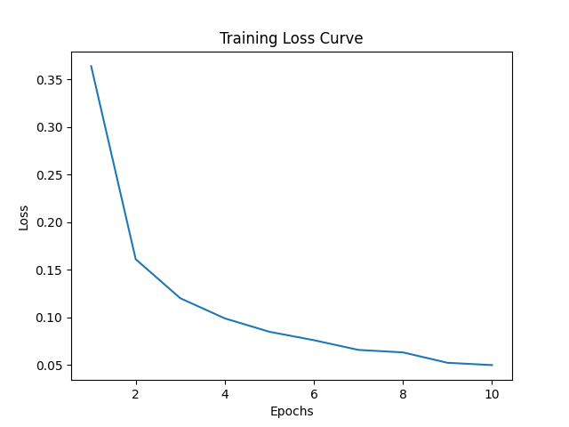

# Assignment 2: Implement Back Propagation Algorithm for A Three-layer Neural Network Model

## 0.Overview

This project involves training a neural network to classify images from the MNIST dataset, a benchmark dataset consisting of 28x28 grayscale images of handwritten digits. The goal of this project is to create, train, and evaluate a neural network model using PyTorch, and visualize the training process in real-time with dynamic loss plotting.

## 1.Quick Start

Clone the repository:

```bash
git clone https://github.com/ShinyueYao/ZJU_CSE3022M.git
```

Then create the conda environment:
```bash
conda env create -f environment.yml
conda activate bp
```

## 2.Method

### Architecture:
The architecture of this assignment is:


- Input layer: 784 neurons (for the 28x28 pixels of each MNIST image).
- Hidden layer 1: 128 neurons with ReLU activation.
- Hidden layer 2: 64 neurons with ReLU activation.
- Output layer: 10 neurons (one for each MNIST digit class, ranging from 0 to 9).

### Training Process:

The model is trained for 10 epochs using Stochastic Gradient Descent (SGD) as the optimizer with a learning rate of 0.02 and momentum of 0.9. 

During the training process:

- A progress bar shows the completion of each epoch.
The training loss is computed using 

```bash
Epoch 1/10: 100%|████████████████████████████████████████████████| 938/938 [00:08<00:00, 112.30it/s]
Epoch 1/10, Loss: 0.3636
Epoch 2/10: 100%|████████████████████████████████████████████████| 938/938 [00:08<00:00, 106.22it/s]
Epoch 2/10, Loss: 0.1609
Epoch 3/10: 100%|████████████████████████████████████████████████| 938/938 [00:08<00:00, 107.28it/s]
```

**CrossEntropyLoss**.
- A real-time plot is generated to visualize the training loss after each epoch.

### Loss Visualization:
The loss curve is dynamically updated during training. The plot is cleared and redrawn after each epoch to show how the loss changes. Loss images are saved after each epoch for reference (e.g., ``image/loss_epoch_1.png``, ``image/loss_epoch_2.png``).


### Testing the Model:
After training is complete, the model is evaluated on the test set. The accuracy is calculated and printed as a percentage.

```bash
Epoch 10/10: 100%|███████████████████████████████████████████████| 938/938 [00:08<00:00, 104.84it/s]
Epoch 10/10, Loss: 0.0496
Test Accuracy: 97.38%
```

### Output Files:
- **Model**: The trained model weights are saved to ``model/mnist_model.pth``.
- **Loss Curve Images**: Images of the loss curve for each epoch are saved in the ``image`` folder